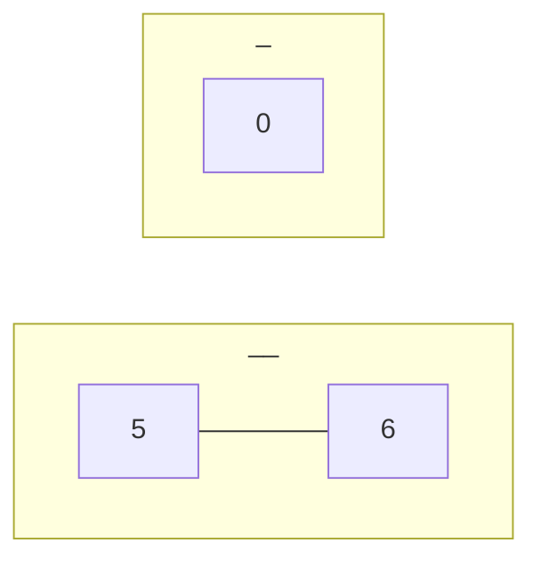

## The problem

```mermaid
    flowchart LR
        subgraph __
            direction LR
            5---6
        end
        subgraph _
            0
        end
```
1. we need to check if a node belongs to a group in o(1)
2. We need to join in a O(1)

TODO implement the algorithm