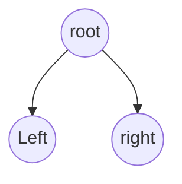

###Notes about iterative traversal

### preOrder - inorder - postOrder traversal

####Recursive
```C++
    void traverse(Node* node){
        if(node == nullptr)
            return;
        //{process?} preOrder
        traverse(node->left);
        //{process?} inOrder
        traverse(node->right);
        //{process?} [postOrder]
    }
```

####Iterative
```C++
    ptr = rootNode;
    last_visited = nullptr;
    /*
    this is for traversing the right
    the stack is for holding the inner loop nodes
    lastVisited to keep track of the outer loop stack
    */
    while(ptr != nullptr && !stack.empty() &&last_visited != root){

        //This loop is intended for the left branch
        while(ptr!=nullptr){
            //! {Process} ? preOrder Traversal
            s.push_back(ptr);
            ptr = ptr->left;
        }
        /*
        here you are at 
        the leaf of the prev node = nullptr 🛩️
        */
        ptr = stack.back(); 
        //! {Process} ? inOrder Traversal
        // So now you're propagating backward with the node from the left
        stack.pop_back();
        //Now for the right go the other
        /*
        😈😈😈😈😈😈😈
        Now for handling post order 
        There is two possibilities
            it can be null
            or it can be visited before
        */
        ptr = ptr->right;
        //IF NULL {process} ? POSTORDER traversal
    }
```
Three remarks about the iterative approach:
1) function calls are reversed as while loops
2) Three lines where the variable changes
   1) within the inner loop -> traversing left
   2) after the inner loop -> going backward
   3) before the outer loop ends it's iteration -> going right
3) For each loop there is a stack 


###let's talk about each remark
#### 1- function calls are reversed 

* Funtion calls doesn't stop untill it returns then process next line, so whatever code is between the definition of the function and the it's call is an iterative loop till it breaks (returns)
* For each function call there is another recursive call to traverse right then do the same and traverse left.
* so we wrap the previous iterative loop with another
